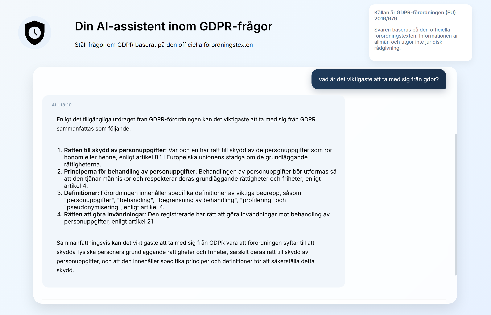

# 🧠 GDPR Expert Chat AI Assistant (RAG-based)

A full-stack AI-powered chat assistant designed to answer questions about GDPR (General Data Protection Regulation) using a Retrieval-Augmented Generation (RAG) architecture.

Built with .NET (ASP.NET Core Web API) and React, the system retrieves relevant GDPR-related knowledge from a curated document base and uses an LLM to generate accurate, context-aware explanations.

## ⚙️ Tech Stack
Frontend: React (TypeScript)
Backend: ASP.NET Core Web API (.NET)
AI Model: OpenAI / LLM API
Vector Database: Semantic search over GDPR knowledge base
Architecture: Retrieval-Augmented Generation (RAG)

## 🧩 What it does 
This assistant is trained to act as a domain expert in GDPR, helping users understand regulations, principles, and rights under EU data protection law.

It does not enforce GDPR, but instead provides explanations, guidance, and interpretations based on retrieved legal and informational content.

## 🔄 How it works
User asks a GDPR-related question in the React chat UI
Query is sent to the .NET API
The query is converted into embeddings
Relevant GDPR documents are retrieved from the vector database
The LLM generates a response based on retrieved context
Answer is returned to the user in natural language

## 🎨 Frontend (React)

Provides:

Chat interface
Conversation history
Real-time messaging UX
Loading / streaming responses

## 🧠 RAG Approach

Instead of relying purely on model training data, the system:

Retrieves relevant GDPR documents
Grounds answers in actual legal text
Reduces hallucinations
Improves explainability and consistency